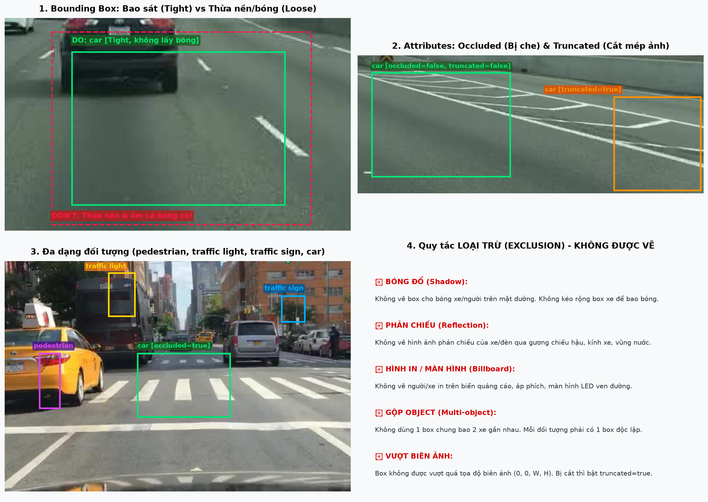
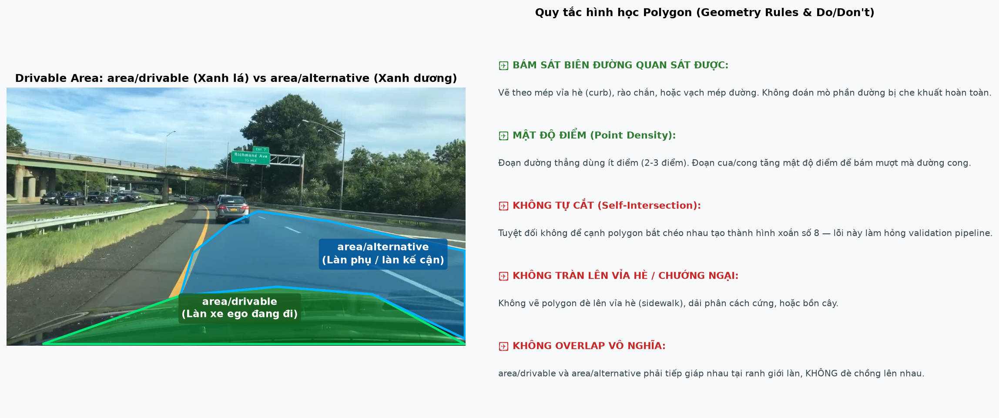
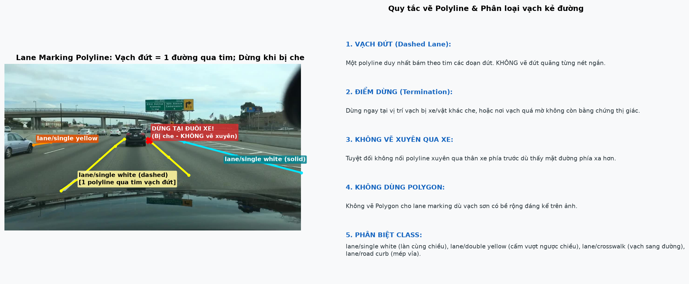
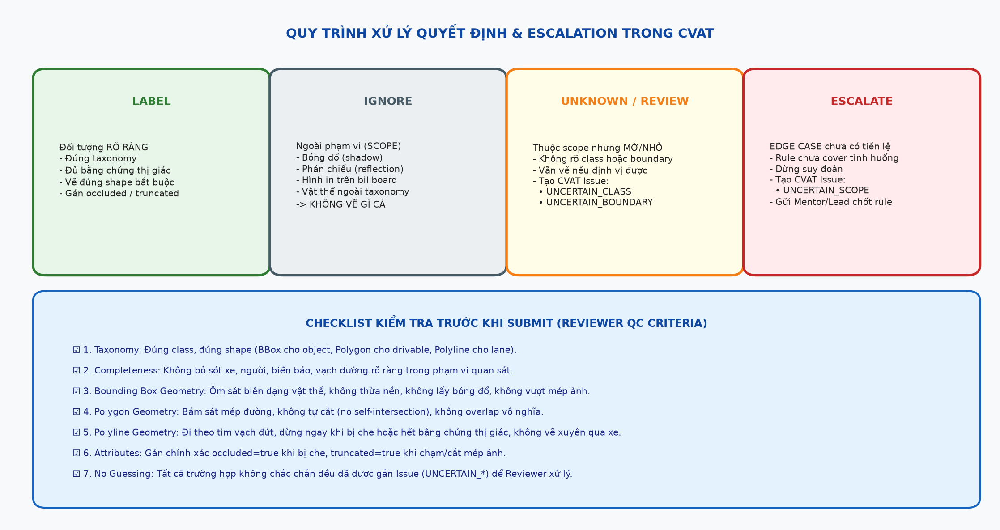

# Annotation Guideline — BDD100K 2D Road Elements
## Bounding Box, Polygon & Polyline

**Version: v1**

> **Nguồn chuẩn hóa:** Tài liệu *"AI20K • Data Annotation • BDD100K 2D Guideline — ANNOTATION GUIDELINE: Bounding Box, Polygon & Polyline (Hướng dẫn thực hành cho học viên trên CVAT)"*, Rule Set **G01**.  
> Được thiết kế chuẩn hóa theo cấu trúc 10 mục bắt buộc của Day 9 Lab — Road Elements Guideline Design Challenge. Nếu guideline chính thức của batch/khách hàng có quy định đặc thù khác, guideline của batch/khách hàng được ưu tiên.

---

## 1. Objective + Scope

- **Mục tiêu:** Tạo dữ liệu annotation 2D **nhất quán, đúng taxonomy và đạt chuẩn chất lượng sản xuất** trên tập ảnh giao thông đường bộ BDD100K (`images/`, định dạng `.jpg`). Dữ liệu này đủ tiêu chuẩn để phục vụ công tác review độc lập, đo lường độ trùng khớp với Ground Truth (GTS / Calibration / Blind Test), và cấp vào pipeline huấn luyện/đánh giá (training/evaluation) cho các mô hình tự hành (Autonomous Driving Perception & Planning).
- **Công cụ thực hiện:** CVAT (Computer Vision Annotation Tool).
- **Phạm vi gồm 3 nhóm nhãn độc lập**, mỗi nhóm bắt buộc sử dụng đúng một loại shape hình học duy nhất trong CVAT:

| Nhóm nhãn | CVAT Shape | Mục đích & Ý nghĩa |
|---|---|---|
| **Object instance** | **Rectangle / Bounding Box** | Định vị và phân loại từng đối tượng giao thông rời rạc (phương tiện, người, biển báo, đèn giao thông). |
| **Drivable area** | **Polygon** | Khoanh vùng chính xác bề mặt lòng đường mà xe có thể / được phép lưu thông (`drivable` vs `alternative`). |
| **Lane marking** | **Polyline** | Vẽ bám theo tim hoặc biên của các vạch sơn kẻ đường và mép bó vỉa. |

> [!IMPORTANT]
> **Quy tắc bất biến:**
> - Tuyệt đối **không dùng Polygon và Polyline thay thế lẫn nhau** trong cùng một bài làm. Drivable area bắt buộc dùng Polygon; Lane marking bắt buộc dùng Polyline. Việc tráo đổi shape sẽ làm hỏng hoàn toàn pipeline chấm điểm và evaluation tự động.
> - **Chỉ annotate các class được quy định trong tài liệu này (Mục 4).**
> - Không tự ý tạo class mới, không đổi tên class, không gộp class theo suy đoán cảm tính.
> - Học viên **không** được sử dụng annotation/ground truth có sẵn trong quá trình làm bài.

---

## 2. Annotation Unit

- **Bounding Box (Object instance):**
  - **Một box = Một đối tượng độc lập (Single instance).**
  - Không bao giờ gộp nhiều đối tượng đứng sát nhau vào cùng một box chung.
- **Polygon (Drivable area):**
  - **Một polygon = Một vùng bề mặt đường liên tục.**
  - Phân định rõ ràng giữa làn đường xe ego đang chạy trực tiếp (`area/drivable`) và các làn kế cận/thay thế (`area/alternative`).
- **Polyline (Lane marking):**
  - **Một polyline = Một vệt vạch kẻ đường liên tục** cùng ý nghĩa ngữ nghĩa (semantic).
  - Vạch đứt quãng (dashed line) được tính là **một polyline duy nhất** chạy dọc qua tim của các nét đứt, không ngắt quãng thành từng polyline nhỏ theo từng sọc sơn.

---

## 3. Geometry Rule

### 3.1. Bounding Box (Object Instance)
- **Bao sát đối tượng (Tight Box):** Vẽ box ôm khít các mép ngoài cùng nhìn thấy được của đối tượng (visible boundary), hạn chế tối đa phần nền thừa (background padding). Lệch biên chấp nhận $\le 2\text{ px}$.
- **Không bao giờ vẽ box vượt ra ngoài mép ảnh:** Giới hạn tọa độ luôn nằm trong $[0, 0, W, H]$. Đối tượng bị cắt ở biên ảnh phải dừng đúng mép frame và bật thuộc tính `truncated = true`.
- **Loại trừ bóng đổ và phản chiếu:** Không bao gồm bóng của xe/người trên mặt đường; không kéo dài box để ôm bóng đổ.
- **Vật thể bị che khuất một phần (Occluded):** Vẫn vẽ box ôm trọn phần nhìn thấy của vật thể nếu còn đủ bằng chứng thị giác để nhận diện class; bật `occluded = true`. Không vẽ "amodal bounding box" suy đoán phần bị che khuất nếu không có quy định riêng.

### 3.2. Polygon (Drivable Area)
- **Bám sát biên quan sát được:** Vẽ bám khít mép lòng đường nhìn thấy được (mép vỉa hè, rào chắn hộ lan, vạch mép đường). Tuyệt đối không phóng to hoặc vẽ tràn ra ngoài theo suy đoán.
- **Không tự cắt (No Self-Intersection):** Không để các cạnh của cùng một polygon chéo qua nhau tạo thành hình xoắn số 8 hoặc nút thắt. Lỗi self-intersection sẽ khiến hệ thống validation từ chối file export.
- **Mật độ điểm tối ưu:** Trên các đoạn đường thẳng chỉ dùng ít điểm (2–3 điểm); tăng dày mật độ điểm tại các đoạn đường cong hoặc nút giao phức tạp để đảm bảo đường bao mượt mà.
- **Không tạo vùng overlap vô nghĩa:** Vùng `area/drivable` và `area/alternative` tiếp giáp nhau tại ranh giới làn đường, không được đè chồng chéo lên nhau. Không vẽ tràn lên vỉa hè (sidewalk) hay dải phân cách.

### 3.3. Polyline (Lane Marking)
- **Bám tim vạch kẻ đường:** Polyline phải đi chính xác theo đường tim (centerline) của vạch sơn.
- **Hướng vẽ nhất quán:** Giữ chiều vẽ từ gần đến xa (hoặc theo hướng di chuyển của xe) trong suốt toàn bộ dataset.
- **Quy tắc dừng polyline (Termination Rule):**
  - Dừng polyline ngay tại điểm vạch sơn bị phương tiện khác che khuất (**không vẽ xuyên qua xe**).
  - Dừng polyline tại điểm vạch sơn mờ dần và không còn đủ bằng chứng thị giác rõ ràng trên ảnh.
- **Không dùng Polygon thay Polyline:** Dù vạch sơn có bề rộng lớn trên thực tế, vẫn bắt buộc dùng Polyline.

---

## 4. Taxonomy (Class vs. Attribute Design)

Bảng taxonomy chuẩn hóa gồm 19 classes chia làm 3 nhóm hình học và 2 attributes:

| Nhóm | CVAT Shape | Danh sách Class chính thức |
|---|---|---|
| **Object instance** | Rectangle / BBox | `pedestrian`, `rider`, `car`, `truck`, `bus`, `train`, `motorcycle`, `bicycle`, `traffic light`, `traffic sign` |
| **Drivable area** | Polygon | `area/drivable`, `area/alternative` |
| **Lane marking** | Polyline | `lane/crosswalk`, `lane/double white`, `lane/double yellow`, `lane/road curb`, `lane/single other`, `lane/single white`, `lane/single yellow` |

### Hệ thống Attributes (Áp dụng cho Object Instance — BBox):

| Tên Attribute | Kiểu / Giá trị | Mặc định | Khi nào bật |
|---|---|---|---|
| `occluded` | `true` / `false` | `false` | Bật `true` khi vật thể vẫn nằm trong khung cảnh nhưng một phần bị che khuất bởi đối tượng khác (xe, cột đèn, người,...). |
| `truncated` | `true` / `false` | `false` | Bật `true` khi vật thể bị cắt bởi mép biên ảnh, phần còn lại của vật thể nằm ngoài khung hình camera. |

> [!NOTE]
> **Nguyên tắc phân định Class vs Attribute:**
> - Dùng **Class** khi bản chất đối tượng và logic downstream khác nhau hoàn toàn (ví dụ: `car` vs `truck` vs `bus` có hình dáng, trọng tải, và quy chuẩn an toàn khác nhau; `area/drivable` vs `area/alternative` quyết định vùng điều khiển tay lái).
> - Dùng **Attribute** khi đây là trạng thái biến thiên của cùng một vật thể mà không làm thay đổi bản chất của nó (ví dụ: bất kỳ chiếc xe nào cũng có thể bị `occluded` hoặc `truncated` tùy vị trí camera).

---

## 5. Inclusion / Exclusion

### 5.1. Bắt buộc Annotate (Inclusion)
- Tất cả các đối tượng thuộc 10 class object instance, 2 class drivable area và 7 class lane marking nhìn thấy được trong ảnh và có đủ bằng chứng thị giác.
- Các đối tượng bị che một phần hoặc bị cắt mép nhưng vẫn nhận diện được class rõ ràng.
- Các đối tượng ở xa hoặc kích thước nhỏ nhưng đường nét/đèn/hình dáng còn đủ rõ để khẳng định class.

### 5.2. Tuyệt đối Loại trừ (Exclusion — IGNORE)
- **Bóng đổ (Shadows):** Không vẽ bóng của xe cộ, người đi bộ, cột điện đổ xuống mặt đường.
- **Hình phản chiếu (Reflections):** Không annotate hình ảnh phản chiếu trên mặt kính xe, vũng nước đọng, gương chiếu hậu.
- **Hình in trên biển quảng cáo/màn hình (Billboard / Advertisements):** Không annotate hình ảnh người, xe hơi hoặc đồ vật in trên các pano quảng cáo hoặc màn hình LED bên đường.
- **Vật thể ngoài danh mục:** Rào chắn tạm thời không phải curb, cây cối, động vật, tòa nhà, thùng rác,... (trừ khi có phụ lục batch yêu cầu).

---

## 6. Visibility / Occlusion

Bảng quy ước chi tiết cho các trường hợp che khuất và cắt mép:

| Tình huống hiển thị | Giá trị Attribute | Tiêu chuẩn áp dụng & Ví dụ |
|---|---|---|
| **Hiển thị đầy đủ** | `occluded=false` `truncated=false` | Vật thể nằm trọn vẹn trong ảnh, không bị vật cản nào che khuất (xe chạy đơn độc phía trước). |
| **Bị che một phần** | `occluded=true` `truncated=false` | Vật thể bị che khuất một phần bởi xe khác, người đi bộ, cột biển báo hoặc cây cối (ví dụ: xe con đỗ sau xe tải lớn, người chỉ nhìn thấy nửa thân trên). |
| **Bị cắt bởi biên ảnh** | `occluded=false` `truncated=true` | Vật thể nằm ở sát mép trái, mép phải, mép trên hoặc mép dưới của ảnh; một phần thân nằm ngoài tầm nhìn camera. |
| **Vừa che vừa cắt mép** | `occluded=true` `truncated=true` | Vật thể xuất hiện ở mép ảnh và đồng thời bị một vật thể khác trong khung hình che lấp một phần. |

> [!CAUTION]
> **Nguyên tắc đối với vật thể quá nhỏ hoặc quá mờ:**
> Không bỏ sót vật thể chỉ vì kích thước nhỏ hoặc ở xa. Tuy nhiên, nếu vật thể quá mờ/nhỏ đến mức **không thể khẳng định chắc chắn class** bằng mắt thường, **tuyệt đối không tự đoán**, phải đưa vào quy trình Review (tạo Issue `UNCERTAIN_CLASS`).

---

## 7. Ambiguity & Escalation (LABEL / IGNORE / UNKNOWN / ESCALATE)

Mọi quyết định xử lý tình huống nghi ngờ phải được thể hiện tường minh trên hệ thống CVAT (qua Shape, Attribute, hoặc Issue/Comment). Quyết định chỉ trao đổi bằng miệng sẽ bị coi là không tồn tại.

| Quyết định | Khi nào áp dụng | Cách thể hiện trong CVAT |
|---|---|---|
| **LABEL** | Đối tượng có class và boundary rõ ràng, đủ bằng chứng thị giác. | Vẽ đúng shape (BBox/Polygon/Polyline), chọn đúng class và gán attribute chuẩn. |
| **IGNORE** | Nằm trong danh sách Exclusion (bóng đổ, phản chiếu, hình in trên pano, vật ngoài taxonomy). | Bỏ qua hoàn toàn, không tạo annotation. |
| **UNKNOWN / CẦN REVIEW** | Thuộc scope nhưng quá mờ, bị che khuất nặng, hoặc không phân biệt được giữa 2 class tương đồng. | Vẽ shape nếu còn xác định được vị trí, tạo **CVAT Issue** tương ứng theo bảng dưới. |
| **ESCALATE** | Tình huống lạ (Edge Case) chưa từng có tiền lệ hoặc rule hiện tại chưa bao quát được. | Tạo **CVAT Issue** loại `UNCERTAIN_SCOPE`, gắn cờ escalate để Mentor/Lead duyệt quy tắc mới. **Không tự sáng tác rule!** |

### Các loại Issue Type chuẩn hóa trong CVAT:
1. `UNCERTAIN_CLASS`: Phân vân giữa hai class (ví dụ: `car` vs `truck`, `truck` vs `bus`, `single white` vs `single other`).
2. `UNCERTAIN_BOUNDARY`: Không xác định rõ ranh giới mép do bị che khuất nặng hoặc ánh sáng chói/tối quá mức.
3. `UNCERTAIN_SCOPE`: Không rõ vật thể có thuộc phạm vi yêu cầu gán nhãn của dự án hay không.
4. `ATTRIBUTE_CHECK`: Nghi ngờ trạng thái gán `occluded` hoặc `truncated`.

---

## 8. Temporal Rule

- **Dataset BDD100K trong bài thực hành gồm các ảnh tĩnh độc lập (`.jpg`):**
  - **Mỗi ảnh được gán nhãn hoàn toàn độc lập (Independent image-level annotation).**
  - Áp dụng nguyên tắc "Draw what you see" (Vẽ chính xác những gì nhìn thấy trong khung hình hiện tại).
  - Không suy diễn thông tin từ các frame ảnh khác trừ khi bài toán cụ thể cho phép.
- **Nếu mở rộng sang chuỗi video liên tục (Video/Track mode):**
  - Track ID được duy trì qua các frame cho cùng một object instance.
  - Được phép tham chiếu các frame lân cận để xác định chính xác class của vật thể bị mờ tạm thời.

---

## 9. Examples & Visual Illustrations (Ảnh minh họa cho nhãn)

### 9.1. Minh họa trực quan cho Bounding Box (Object Instance)

*Chi tiết minh họa trên hình 1:*
1. **Ô vuông trên-trái (DO vs DON'T):** Khung màu xanh lá (`car`) ôm khít mép ngoài của chiếc SUV, không ôm bóng đổ mặt đường. Khung đỏ đứt nét thể hiện lỗi sai: vẽ quá rộng, ôm cả phần bóng xe.
2. **Ô vuông trên-phải (Attributes):** Xe đi trước nằm trọn vẹn trong ảnh (`occluded=false, truncated=false`). Xe ở mép phải chạm biên ảnh được gán `truncated=true`.
3. **Ô vuông dưới-trái (Multi-class):** Phân định ranh giới giữa `traffic light` (vàng), `traffic sign` (xanh dương), `pedestrian` (tím) và `car` tại ngã tư.
4. **Ô vuông dưới-phải (Quy tắc loại trừ):** Tóm tắt 5 nguyên tắc cấm: Không lấy bóng đổ, không lấy phản chiếu kính, không lấy hình in billboard, không gộp nhiều đối tượng vào 1 box, không vẽ box vượt ngoài tọa độ biên ảnh.

---

### 9.2. Minh họa trực quan cho Drivable Area (Polygon)

*Chi tiết minh họa trên hình 2:*
- **Vùng màu xanh lá (`area/drivable`):** Vùng lòng đường xe ego đang trực tiếp lưu thông, bám sát mép vỉa và vạch kẻ làn.
- **Vùng màu xanh dương (`area/alternative`):** Các làn đường cùng chiều hoặc đối diện kế cận mà xe có thể chuyển làn sang.
- **Quy tắc hình học bắt buộc:** Polygon không tự cắt (no self-intersection), không tràn lên vỉa hè hoặc dải phân cách cứng, không đè chồng chéo (overlap) giữa drivable và alternative.

---

### 9.3. Minh họa trực quan cho Lane Marking (Polyline)

*Chi tiết minh họa trên hình 3:*
- **Vạch đứt màu vàng/trắng (`lane/single white - dashed`):** Một đường polyline duy nhất chạy dọc theo tim các vạch sơn đứt quãng. Tuyệt đối không vẽ rời rạc từng nét.
- **Quy tắc dừng polyline khi bị che (Termination at Occlusion):** Polyline dừng lại chính xác tại mép đuôi xe phía trước (điểm dấu X đỏ). Tuyệt đối **không vẽ nối tiếp xuyên qua thân xe**.
- **Điểm dừng khi vạch mờ:** Khi vạch sơn biến mất hoặc bị lóa sáng không còn bằng chứng thị giác, kết thúc polyline tại điểm đó.
- **Phân loại vạch:** `lane/single white` (vạch đơn cùng chiều), `lane/single yellow` / `lane/double yellow` (vạch vàng phân chia chiều đường), `lane/crosswalk` (vạch người đi bộ qua đường), `lane/road curb` (mép bó vỉa).

---

### 9.4. Sơ đồ xử lý Quyết định & Tiêu chí Review (CVAT Decision Flowchart)

### Bảng tra cứu tình huống thực tế (Positive, Negative, Edge Cases):

| Sample ID | Tình huống quan sát | Quyết định & Output | Rule áp dụng |
|---|---|---|---|
| `BDD01` | Xe SUV màu đen chạy phía trước trong làn ego | BBox sát thân xe `car` (`occluded=false`, `truncated=false`) | BBox ôm khít, không lấy bóng đổ |
| `BDD01` | Xe con ở sát rìa phải ảnh bị cắt nửa thân | BBox `car` (`truncated=true`) | Chạm mép ảnh, không vẽ vượt biên |
| `BDD01` | Vạch kẻ đứt màu trắng phân làn cao tốc | 1 Polyline `lane/single white` qua tim vạch đứt | Vạch đứt vẽ 1 đường liền qua tim |
| `BDD01` | Vạch sơn bị thân xe SUV phía trước che lấp | Dừng Polyline tại đuôi xe | Bị che thì dừng, không vẽ xuyên qua xe |
| `BDD02` | Người đi bộ đang qua đường tại nút giao | BBox `pedestrian` ôm khít thân người | 1 box cho 1 người, không gộp |
| `BDD02` | Cụm đèn tín hiệu giao thông treo trên cao | BBox `traffic light` ôm trọn hộp đèn | Bao gồm cả hộp chứa các mắt đèn |
| `BDD02` | Vạch sang đường cho người đi bộ (zebra) | Polyline `lane/crosswalk` bám biên cụm vạch | Không vẽ từng sọc nhỏ lẻ |
| `BDD03` | Lòng đường xe đang chạy trên cao tốc cong | Polygon `area/drivable` (xanh lá) bám mép đường | Mật độ điểm dày ở đoạn cong |
| `BDD03` | Làn xe phụ bên cạnh | Polygon `area/alternative` tiếp giáp mép làn ego | Không tạo vùng overlap |
| `BDD04` | Biển báo cấm / chỉ dẫn ven đường | BBox `traffic sign` ôm sát biển | Biển rõ ràng -> LABEL |
| `BDD18` | Xe ở rất xa trong đêm, chỉ thấy 2 đốm sáng đỏ | Tạo Issue `UNCERTAIN_CLASS` | Không đủ bằng chứng -> Review, không đoán |
| `BDD20` | Hình người in trên áp phích bên đường | **IGNORE** (Không vẽ) | Exclusion: billboard advertisement |

---

## 10. Common Mistakes & Cách khắc phục

1. **Gộp nhiều đối tượng vào một box:**
   - *Lỗi:* Thấy 2 xe đi sát nhau hoặc nhóm người đi bộ liền vẽ 1 box to bao hết.
   - *Khắc phục:* Luôn tách riêng mỗi cá thể là một BBox độc lập (`1 instance = 1 box`).
2. **Kéo BBox bao trùm cả bóng đổ xe:**
   - *Lỗi:* Thấy bóng xe đen kịt trên mặt đường liền kéo box xuống sát bóng.
   - *Khắc phục:* Chỉ ôm sát phần kim loại/bánh xe chạm đất, loại trừ toàn bộ bóng đổ.
3. **Vẽ BBox vượt ra ngoài biên ảnh:**
   - *Lỗi:* Tọa độ x, y âm hoặc lớn hơn chiều rộng/cao của ảnh.
   - *Khắc phục:* Box phải dừng lại ở pixel mép ảnh và bật `truncated = true`.
4. **Vẽ Polyline xuyên qua xe cộ:**
   - *Lỗi:* Đoán vạch kẻ đường vẫn chạy thẳng dưới gầm xe nên vẽ nối liền qua thân xe phía trước.
   - *Khắc phục:* Gặp chướng ngại che khuất phải ngắt polyline tại mép cản trước/sau của xe.
5. **Dùng nhầm Polygon cho vạch kẻ đường:**
   - *Lỗi:* Thấy vạch sơn to dày nên dùng Polygon tô kín.
   - *Khắc phục:* Mọi loại vạch kẻ đường bắt buộc dùng Polyline bám tim vạch.
6. **Polygon tự cắt (Self-intersection) hoặc overlap:**
   - *Lỗi:* Điểm vẽ chéo qua nhau tạo hình thắt nút; hoặc vùng `area/drivable` trùm lên `area/alternative`.
   - *Khắc phục:* Kiểm tra kỹ hình học polygon, các vùng phân chia làn phải tiếp giáp nhau chứ không chồng lấn.
7. **Đoán mò thay vì báo cáo Issue:**
   - *Lỗi:* Thấy vật thể mờ ảo không rõ là xe tải hay xe bus nhưng vẫn chọn đại `truck`.
   - *Khắc phục:* Dừng suy đoán, tạo Issue `UNCERTAIN_CLASS` để Reviewer/Mentor xử lý.

---

## Phụ lục 1: Checklist Chất Lượng Trước Khi Submit

Trước khi nộp bài hoặc chuyển task sang Validation, annotator phải tự rà soát theo 9 tiêu chí:

- [ ] **1. Đúng Taxonomy & Shape:** 100% đối tượng được vẽ bằng đúng loại shape quy định (BBox cho Object, Polygon cho Drivable Area, Polyline cho Lane Marking).
- [ ] **2. Không bỏ sót (Completeness):** Không bỏ quên xe, người, biển báo, đèn tín hiệu hoặc vạch đường rõ ràng trong phạm vi quan sát.
- [ ] **3. Không trùng lặp (No Duplication):** Không có 2 annotations vẽ trùng lặp cho cùng một đối tượng.
- [ ] **4. BBox ôm khít (Tight Box):** Khung bao sát đối tượng, không thừa nền, không chứa bóng đổ, không vượt quá mép ảnh.
- [ ] **5. Polygon chuẩn xác:** Bám sát mép lòng đường, không tự cắt (no self-intersection), không chồng lấn vô nghĩa, không tràn lên vỉa hè.
- [ ] **6. Polyline đúng quy ước:** Bám tim vạch đứt, dừng đúng điểm khi bị che hoặc hết bằng chứng thị giác, không vẽ xuyên qua xe.
- [ ] **7. Attributes chính xác:** Gán đúng `occluded=true` khi bị che và `truncated=true` khi chạm mép ảnh.
- [ ] **8. Không có class lạ:** Không tự ý tạo thêm nhãn mới hoặc đổi tên nhãn chuẩn.
- [ ] **9. Mọi ca nghi ngờ đã tạo Issue:** Tất cả các trường hợp không chắc chắn đều có Issue/Comment rõ ràng, không có trường hợp "đoán bừa".

---

## Phụ lục 2: Tiêu Chí Reviewer Kiểm Tra (Audit Matrix)

| Hạng mục kiểm tra | Nội dung Reviewer đánh giá | Mức độ nghiêm trọng nếu sai |
|---|---|---|
| **Taxonomy Compliance** | Gán đúng class trong 19 class cho phép; đúng loại shape quy định; không có class ngoài taxonomy. | **Critical** (Hỏng pipeline đánh giá) |
| **Completeness** | Không bỏ sót đối tượng rõ ràng; không vẽ thừa đối tượng trong danh mục loại trừ (shadow, billboard). | **High** (Ảnh hưởng độ nhạy Recall) |
| **Geometry Accuracy** | Box ôm khít mép đối tượng; polygon không tự cắt; polyline không vẽ xuyên xe; không vượt mép ảnh. | **High** (Sai lệch vị trí tọa độ IoU) |
| **Attribute Precision** | Bật đúng `occluded` khi bị che và `truncated` khi bị cắt mép ảnh. | **Medium** (Chất lượng metadata) |
| **Consistency** | Các tình huống tương đồng trong toàn bộ dataset được xử lý theo cùng một quy chuẩn duy nhất. | **High** (Độ nhất quán dữ liệu) |
| **Escalation Protocol** | Không tự ý sáng tạo quy tắc đối với edge case; mọi ca lạ đều được chuyển lên Lead/Mentor. | **Critical** (Tuân thủ quy trình vận hành) |

---

## Phụ lục 3: Bảng Tra Cứu Nhanh (Quick Reference)

| Tình huống thực tế | Hành động bắt buộc (Làm gì) | Hành động cấm (Không làm) | Cần Review? |
|---|---|---|---|
| Xe / Người hiển thị rõ ràng | Vẽ BBox ôm khít đối tượng | Không gộp nhiều đối tượng vào 1 box | Không |
| Xe bị che khuất một phần | BBox phần nhìn thấy + gán `occluded=true` | Không bỏ sót chỉ vì bị che | Không (nếu class rõ) |
| Xe bị cắt bởi mép ảnh | BBox chạm mép + gán `truncated=true` | Không vẽ box tràn ra ngoài mép ảnh | Không (nếu class rõ) |
| Lòng đường lưu thông | Vẽ Polygon bám mép đường | Không dùng Polyline tùy ý | Nếu boundary mờ |
| Vạch kẻ đường | Vẽ Polyline theo tim vạch | Không dùng Polygon thay thế | Nếu class/kiểu vạch mờ |
| Vạch kẻ đường bị xe che | Dừng Polyline tại mép thân xe | Không vẽ nối tiếp xuyên qua thân xe | Không |
| Không chắc chắn về Class | Tạo Issue `UNCERTAIN_CLASS` | Không tự đoán class cho xong việc | **Có** |
| Vật thể quá nhỏ / mờ | Tạo Issue `UNCERTAIN_BOUNDARY` / `SCOPE` | Không tự suy đoán viền | **Có** |

> **Nguyên tắc cốt lõi cuối cùng:**  
> *Nếu hình ảnh không cung cấp đủ bằng chứng thị giác hoặc guideline chưa bao quát tình huống đó: **Dừng suy đoán ngay lập tức, tạo Issue và Escalate cho Lead/Mentor xử lý**.*
